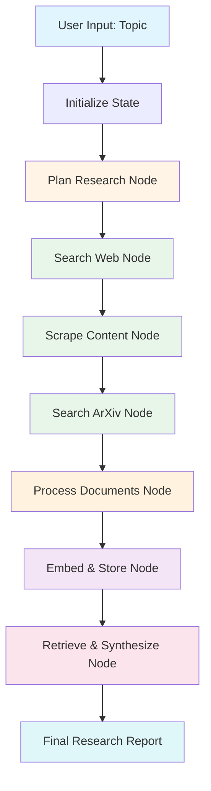
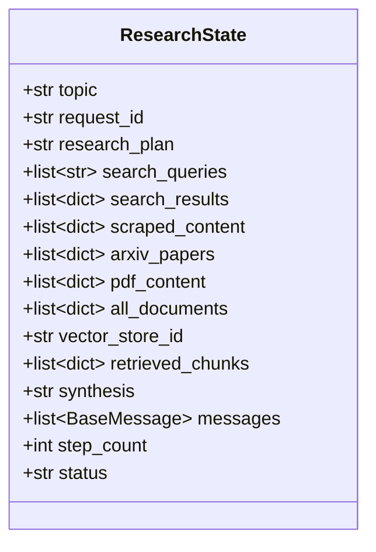
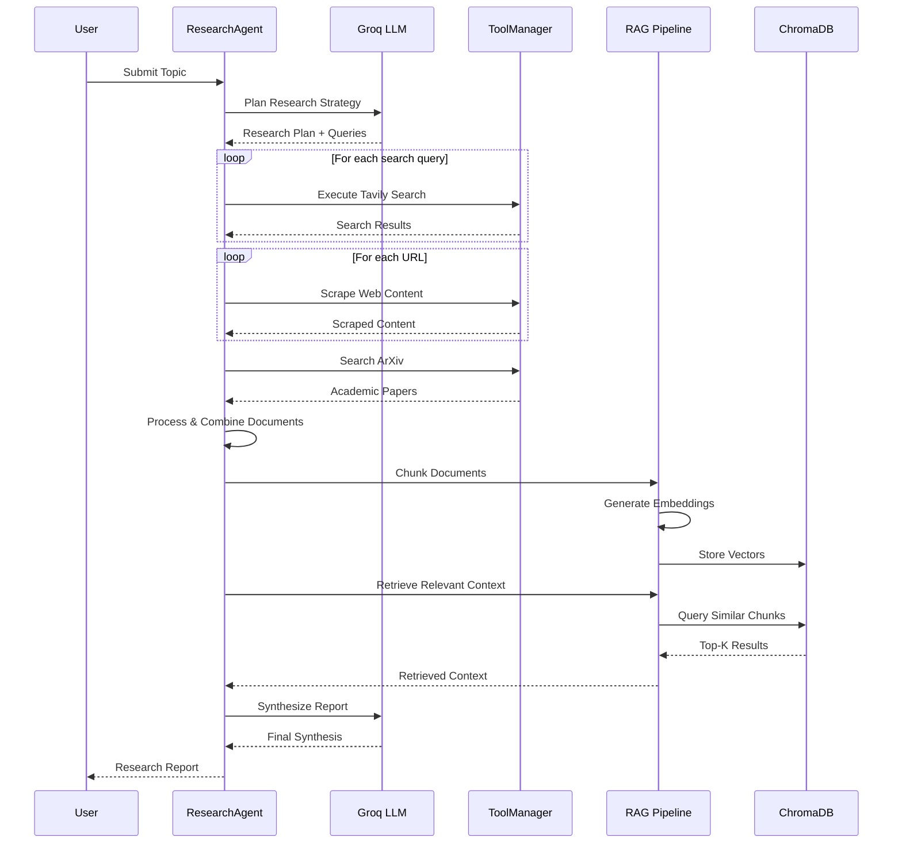
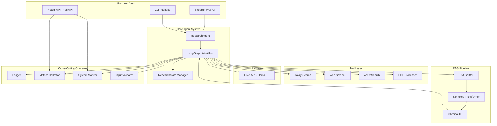
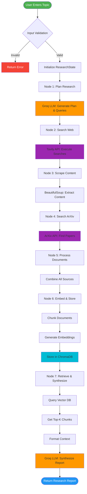
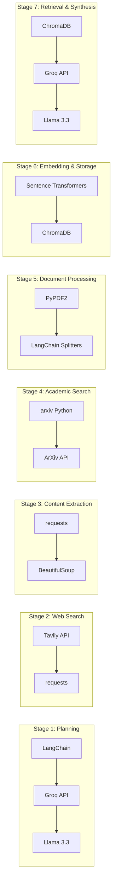

# Autonomous Research Assistant - Architecture & Technical Documentation

## Table of Contents
1. [Full Agent Orchestration](#full-agent-orchestration)
2. [Application Flow](#application-flow)
3. [Technologies Used](#technologies-used)
4. [Technology Alternatives](#technology-alternatives)
5. [Technology Selection Rationale](#technology-selection-rationale)
6. [Recommendations for Improvement](#recommendations-for-improvement)

---

## Full Agent Orchestration

### LangGraph State Machine Architecture

The system uses **LangGraph** to orchestrate a multi-step autonomous research workflow. Each node represents a specific research task, and the state flows sequentially through the pipeline.



### State Management

The `ResearchState` TypedDict maintains the complete state across all nodes:



### Node Workflow Detail



---

## Application Flow

### High-Level Architecture



### Detailed Component Flow



---

## Technologies Used

### Technology Stack by Component

| Component | Technology | Version/Model | Purpose |
|-----------|-----------|---------------|---------|
| **Workflow Orchestration** | LangGraph | Latest | State machine for agent workflow |
| **LLM Framework** | LangChain | Latest | LLM integration and tool management |
| **LLM Provider** | Groq | API | Fast inference engine |
| **LLM Model** | Llama 3.3 70B | 70B parameters | Language understanding & generation |
| **Vector Database** | ChromaDB | Latest | Persistent vector storage |
| **Embeddings** | Sentence Transformers | all-MiniLM-L6-v2 | Document embeddings (384 dims) |
| **Web Search** | Tavily | API | Real-time web search |
| **Web Scraping** | BeautifulSoup4 | 4.x | HTML parsing and content extraction |
| **Academic Search** | ArXiv | Python API | Research paper discovery |
| **PDF Processing** | PyPDF2 | Latest | PDF text extraction |
| **Text Splitting** | LangChain Text Splitters | Latest | Recursive character chunking |
| **Web UI** | Streamlit | Latest | Interactive web interface |
| **Health API** | FastAPI | Latest | RESTful health checks |
| **ASGI Server** | Uvicorn | Latest | Async server for FastAPI |
| **Logging** | Python logging | Built-in | Structured logging |
| **Monitoring** | psutil | Latest | System resource monitoring |
| **Validation** | Pydantic | Latest | Input validation and sanitization |
| **Environment** | python-dotenv | Latest | Environment variable management |
| **HTTP Client** | requests | Latest | HTTP requests |
| **Type Checking** | mypy | Latest | Static type analysis |
| **Code Formatting** | black, ruff | Latest | Code quality tools |

### Technology Flow by Pipeline Stage



---

## Technology Alternatives

### Comprehensive Alternatives Analysis

| Current Technology | Alternatives | Comparison |
|-------------------|--------------|------------|
| **LangGraph** | • LlamaIndex Workflows<br>• Haystack Pipelines<br>• Custom State Machine<br>• Apache Airflow<br>• Prefect | LangGraph provides native LangChain integration and visual workflow debugging. LlamaIndex is better for pure RAG. Custom state machines offer more control but require more code. |
| **Groq** | • OpenAI GPT-4<br>• Anthropic Claude<br>• Google Gemini<br>• Azure OpenAI<br>• Local models (Ollama) | Groq offers fastest inference (300+ tokens/s) but limited model selection. OpenAI has better reasoning. Anthropic has longer context. Local models are free but slower. |
| **Llama 3.3 70B** | • GPT-4 Turbo<br>• Claude 3.5 Sonnet<br>• Gemini Pro<br>• Mixtral 8x7B<br>• Llama 3.1 8B | Llama 3.3 70B balances performance and speed. GPT-4 has better reasoning. Claude better at long context. Smaller models faster but less capable. |
| **ChromaDB** | • Pinecone<br>• Weaviate<br>• Qdrant<br>• Milvus<br>• FAISS<br>• pgvector | ChromaDB is lightweight and embeddable. Pinecone is managed cloud. Weaviate has better hybrid search. Qdrant is faster. FAISS is in-memory only. pgvector leverages PostgreSQL. |
| **Sentence Transformers** | • OpenAI Embeddings<br>• Cohere Embeddings<br>• Voyage AI<br>• E5-large-v2<br>• BGE embeddings | Sentence Transformers are free and local. OpenAI embeddings higher quality but cost money. Cohere good for multilingual. E5/BGE offer better performance. |
| **all-MiniLM-L6-v2** | • all-mpnet-base-v2<br>• e5-large-v2<br>• bge-large-en-v1.5<br>• text-embedding-3-small<br>• instructor-xl | MiniLM is fast (384 dims). mpnet more accurate (768 dims). E5/BGE state-of-the-art. OpenAI embeddings highest quality but API-based. |
| **Tavily** | • Google Search API<br>• Bing Search API<br>• SerpAPI<br>• DuckDuckGo<br>• Custom web crawler | Tavily optimized for AI with relevance scoring. Google/Bing more comprehensive but expensive. SerpAPI aggregates multiple sources. DDG is free but basic. |
| **BeautifulSoup** | • Scrapy<br>• Playwright<br>• Selenium<br>• Trafilatura<br>• newspaper3k | BeautifulSoup simple and lightweight. Scrapy better for large-scale. Playwright/Selenium for JS-heavy sites. Trafilatura optimized for article extraction. |
| **ArXiv API** | • Semantic Scholar API<br>• PubMed API<br>• CrossRef<br>• Google Scholar (unofficial)<br>• OpenAlex | ArXiv great for CS/physics. Semantic Scholar broader coverage. PubMed for medicine. CrossRef for metadata. OpenAlex fully open. |
| **PyPDF2** | • pdfplumber<br>• PyMuPDF (fitz)<br>• pdfminer.six<br>• Camelot<br>• Tabula | PyPDF2 simple but basic. pdfplumber better for tables. PyMuPDF faster. pdfminer handles complex layouts. Camelot/Tabula for structured data. |
| **Streamlit** | • Gradio<br>• Flask + React<br>• FastAPI + Vue<br>• Dash<br>• Chainlit | Streamlit fastest for prototyping. Gradio simpler. Flask/FastAPI+Frontend more customizable. Dash for analytics. Chainlit for chat interfaces. |
| **FastAPI** | • Flask<br>• Django<br>• Sanic<br>• Tornado<br>• aiohttp | FastAPI has automatic OpenAPI docs and async support. Flask simpler. Django full-featured. Sanic faster. aiohttp more low-level. |
| **Python logging** | • Loguru<br>• structlog<br>• python-json-logger<br>• ELK Stack<br>• Datadog | Standard logging is built-in. Loguru simpler API. structlog for structured logs. ELK/Datadog for production observability. |

---

## Technology Selection Rationale

### Why These Technologies Were Chosen

#### 1. **LangGraph for Workflow Orchestration**
**Chosen because:**
- Native integration with LangChain ecosystem
- Visual debugging and state inspection
- Clear state management with TypedDict
- Built-in checkpointing capabilities
- Explicit control flow vs implicit agent loops

**Why not alternatives:**
- LlamaIndex: More opinionated, less flexible for custom workflows
- Custom solution: Too much boilerplate, reinventing the wheel
- Airflow/Prefect: Overkill for this use case, designed for data pipelines

#### 2. **Groq with Llama 3.3 70B**
**Chosen because:**
- **Extremely fast inference** (300-500 tokens/second vs 30-50 for others)
- Free tier with generous limits
- Llama 3.3 70B excellent performance-to-speed ratio
- Open-source model weights (transparency)
- Low latency critical for interactive research

**Why not alternatives:**
- OpenAI GPT-4: Expensive ($0.01-0.03 per 1K tokens), slower
- Claude: More expensive, API rate limits stricter
- Local models: Too slow for interactive use, requires GPU

#### 3. **ChromaDB**
**Chosen because:**
- **Embedded database** - no separate server needed
- Persistent storage to disk
- Simple Python API
- Good for development and small-to-medium scale
- Active development and community

**Why not alternatives:**
- Pinecone/Weaviate: Require external infrastructure, cost money
- FAISS: In-memory only, not persistent
- pgvector: Requires PostgreSQL setup, more complex

#### 4. **Sentence Transformers (all-MiniLM-L6-v2)**
**Chosen because:**
- **Free and runs locally** - no API costs
- Fast inference (384 dimensions)
- Good balance of quality and speed
- Pre-trained on diverse corpus
- No data privacy concerns (local processing)

**Why not alternatives:**
- OpenAI embeddings: Costs add up quickly, API dependency
- Larger models (mpnet, E5): Slower, diminishing returns
- Custom training: Too much effort, not worth it

#### 5. **Tavily for Web Search**
**Chosen because:**
- **Optimized for AI applications** - includes relevance scoring
- Advanced search depth options
- Includes page summaries
- Generous free tier
- Better structured responses than raw search APIs

**Why not alternatives:**
- Google/Bing: More expensive, less AI-friendly output
- DuckDuckGo: Free but basic, no relevance scoring
- SerpAPI: More expensive, just an aggregator

#### 6. **BeautifulSoup for Web Scraping**
**Chosen because:**
- **Simple and reliable** for most websites
- Small footprint
- Easy to extract main content
- Good documentation
- No browser automation overhead

**Why not alternatives:**
- Scrapy: Overkill for small-scale scraping
- Playwright/Selenium: Slow, heavyweight, only needed for JS-heavy sites
- Trafilatura: Less flexible, specific to articles

#### 7. **Streamlit for Web UI**
**Chosen because:**
- **Fastest development time** - pure Python
- Built-in components for ML/data apps
- Automatic reactivity
- Good enough for MVP and internal tools
- Easy deployment

**Why not alternatives:**
- React/Vue: Requires frontend expertise, slower development
- Gradio: Less customizable
- Chainlit: Too specific to chat interfaces

#### 8. **FastAPI for Health API**
**Chosen because:**
- **Automatic OpenAPI documentation**
- Native async support (important for health checks)
- Fast and modern
- Type hints integration with Pydantic
- Industry standard for Python APIs

**Why not alternatives:**
- Flask: Synchronous, no automatic docs
- Django: Too heavyweight for simple API

### Overall Architecture Philosophy

The technology choices reflect these principles:

1. **Speed over perfection**: Groq, MiniLM embeddings prioritize fast iteration
2. **Local-first**: ChromaDB, Sentence Transformers reduce API dependencies
3. **Developer experience**: Streamlit, LangGraph, FastAPI minimize boilerplate
4. **Cost efficiency**: Free tiers and open-source where possible
5. **Simplicity**: Embedded solutions over distributed systems
6. **Type safety**: TypedDict, Pydantic for runtime validation

---

## Recommendations for Improvement

### 1. **Architecture & Scalability**

#### Current Limitations
- Single-threaded processing
- No caching layer
- Embedded database limits scale
- No distributed processing

#### Recommendations

**Short-term (1-3 months):**
- [ ] Add Redis for query result caching
```python
# Pseudo-code
@cache(ttl=3600)
def search_web(query: str) -> List[Dict]:
    return tavily_search(query)
```
- [ ] Implement async/parallel processing for web scraping
- [ ] Add request queuing with Celery or RQ for background jobs
- [ ] Implement document deduplication to avoid redundant processing

**Mid-term (3-6 months):**
- [ ] Migrate to Qdrant or Weaviate for better vector search performance
- [ ] Add horizontal scaling support with Ray or Dask
- [ ] Implement distributed task processing
- [ ] Add load balancing for multiple LLM providers

**Long-term (6-12 months):**
- [ ] Microservices architecture with separate services for:
  - Search & scraping
  - Document processing
  - Vector operations
  - Synthesis
- [ ] Kubernetes deployment with auto-scaling
- [ ] Event-driven architecture with message queues (Kafka/RabbitMQ)

### 2. **LLM & AI Improvements**

**Current Limitations:**
- Single LLM provider (vendor lock-in)
- No fallback on errors
- Limited context window utilization
- No agentic loop refinement

**Recommendations:**

**Short-term:**
- [ ] Multi-provider fallback system
```python
LLM_PROVIDERS = [
    {"provider": "groq", "model": "llama-3.3-70b"},
    {"provider": "openai", "model": "gpt-4o-mini"},
    {"provider": "anthropic", "model": "claude-3-haiku"}
]
```
- [ ] Implement streaming responses for better UX
- [ ] Add query expansion and reformulation
- [ ] Implement citation extraction and verification

**Mid-term:**
- [ ] Multi-agent collaboration (specialist agents for different topics)
- [ ] Add self-reflection and critique nodes
- [ ] Implement conversational refinement (user can ask follow-ups)
- [ ] Context compression for longer documents (LLMLingua, AutoCompressor)

**Long-term:**
- [ ] Fine-tune custom models for research synthesis
- [ ] Implement reinforcement learning from human feedback (RLHF)
- [ ] Add fact-checking and hallucination detection
- [ ] Multi-modal support (images, tables, charts)

### 3. **RAG Pipeline Enhancements**

**Current Limitations:**
- Simple chunking strategy
- No reranking
- Limited metadata filtering
- No hybrid search

**Recommendations:**

**Short-term:**
- [ ] Add cross-encoder reranking (e.g., `ms-marco-MiniLM-L-12-v2`)
```python
# After retrieval
reranked = reranker.rerank(query, retrieved_chunks)
```
- [ ] Implement metadata filtering (source type, date, relevance)
- [ ] Add parent-child chunking for better context
- [ ] Query expansion with generated sub-questions

**Mid-term:**
- [ ] Hybrid search (BM25 + semantic)
- [ ] Implement HyDE (Hypothetical Document Embeddings)
- [ ] Add multi-query retrieval
- [ ] Context window optimization (sliding windows, hierarchical merging)
- [ ] Implement RAG-Fusion for better retrieval

**Long-term:**
- [ ] Graph-based RAG (knowledge graph construction)
- [ ] Corrective RAG (CRAG) with web search fallback
- [ ] Self-RAG (self-critique and retrieval-on-demand)
- [ ] Agentic RAG (agent decides when to retrieve)

### 4. **Data Sources & Tools**

**Current Limitations:**
- Limited to web, ArXiv
- No real-time data
- No structured data sources
- Basic PDF processing

**Recommendations:**

**Short-term:**
- [ ] Add more academic sources (PubMed, Semantic Scholar)
- [ ] Implement news API integration (NewsAPI, GNews)
- [ ] Add YouTube transcript extraction
- [ ] Better PDF processing with pdfplumber or PyMuPDF

**Mid-term:**
- [ ] Database query tools (SQL, MongoDB)
- [ ] API integration framework for custom data sources
- [ ] Social media data (Twitter, Reddit APIs)
- [ ] Financial data sources (Alpha Vantage, Yahoo Finance)
- [ ] Add image understanding (OCR, vision models)

**Long-term:**
- [ ] Custom tool marketplace/plugins
- [ ] Tool learning (agent learns to use new tools)
- [ ] Real-time data streams integration

### 5. **User Experience**

**Current Limitations:**
- No real-time progress streaming
- Limited customization
- No collaboration features
- Basic report formatting

**Recommendations:**

**Short-term:**
- [ ] Real-time streaming of research progress
- [ ] Customizable report templates
- [ ] Export to multiple formats (PDF, DOCX, HTML)
- [ ] Topic suggestions and auto-complete

**Mid-term:**
- [ ] Conversational interface with follow-up questions
- [ ] Compare multiple research topics side-by-side
- [ ] Research history and bookmarking
- [ ] Collaborative research (multi-user, sharing)
- [ ] Mobile-responsive redesign

**Long-term:**
- [ ] Browser extension for on-demand research
- [ ] Slack/Discord bot integration
- [ ] Voice interface
- [ ] Personalized research agent (learns user preferences)

### 6. **Observability & Monitoring**

**Current Limitations:**
- Basic logging
- Limited metrics
- No distributed tracing
- Manual debugging

**Recommendations:**

**Short-term:**
- [ ] Structured JSON logging
- [ ] LangSmith integration for trace analysis
- [ ] Add Prometheus metrics exporter
- [ ] Error alerting (email, Slack)

**Mid-term:**
- [ ] OpenTelemetry for distributed tracing
- [ ] Grafana dashboards for visualization
- [ ] ELK stack for log aggregation
- [ ] Cost tracking per research request

**Long-term:**
- [ ] ML-based anomaly detection
- [ ] A/B testing framework
- [ ] Performance profiling and optimization
- [ ] User analytics and usage patterns

### 7. **Security & Privacy**

**Current Limitations:**
- No user authentication
- API keys in environment
- No data encryption
- Public health API

**Recommendations:**

**Short-term:**
- [ ] Add user authentication (OAuth2, JWT)
- [ ] Encrypt API keys in secure vault (HashiCorp Vault, AWS Secrets)
- [ ] Rate limiting per user
- [ ] Input sanitization improvements

**Mid-term:**
- [ ] Role-based access control (RBAC)
- [ ] Data encryption at rest
- [ ] Audit logging
- [ ] PII detection and redaction
- [ ] GDPR compliance features

**Long-term:**
- [ ] Multi-tenancy support
- [ ] Data residency controls
- [ ] Compliance certifications (SOC2, ISO 27001)
- [ ] Private deployment options

### 8. **Testing & Quality**

**Current Limitations:**
- 80% coverage (good but can improve)
- Limited integration tests
- No performance tests
- Manual testing of LLM outputs

**Recommendations:**

**Short-term:**
- [ ] Increase coverage to 90%+
- [ ] Add end-to-end integration tests
- [ ] Implement LLM output evaluation (RAGAS, TruLens)
- [ ] Add contract testing for APIs

**Mid-term:**
- [ ] Performance benchmarking suite
- [ ] Load testing (Locust, K6)
- [ ] Chaos engineering tests
- [ ] Automated regression testing for LLM outputs

**Long-term:**
- [ ] Continuous evaluation pipeline
- [ ] Automated quality gates in CI/CD
- [ ] Shadow deployment testing
- [ ] Canary deployments with gradual rollout

### 9. **Cost Optimization**

**Current Issues:**
- Potential API cost scaling
- Redundant API calls
- No budget controls

**Recommendations:**

**Short-term:**
- [ ] Implement aggressive caching
- [ ] Add cost tracking per request
- [ ] Budget alerts and limits
- [ ] Batch API calls where possible

**Mid-term:**
- [ ] Intelligent provider selection (cost vs quality)
- [ ] Auto-fallback to cheaper models for simple queries
- [ ] Optimize embedding batch sizes
- [ ] Implement request throttling

**Long-term:**
- [ ] Cost prediction models
- [ ] Multi-region cost optimization
- [ ] Reserved capacity planning
- [ ] Custom model hosting for high volume

### 10. **Developer Experience**

**Current Limitations:**
- Manual setup required
- Limited documentation
- No dev environment automation

**Recommendations:**

**Short-term:**
- [ ] Add Docker Compose for full stack
- [ ] Improve inline documentation
- [ ] Add more examples and tutorials
- [ ] Create troubleshooting guide

**Mid-term:**
- [ ] One-click cloud deployment (Heroku, Railway)
- [ ] Development containers (DevContainers)
- [ ] API client libraries
- [ ] Interactive API playground

**Long-term:**
- [ ] Plugin SDK for extensions
- [ ] GraphQL API option
- [ ] Webhook support
- [ ] Full API documentation with Postman collections

---

## Priority Matrix

### High Priority (Implement First)

1. **Query result caching** - Immediate cost & speed benefits
2. **Multi-provider LLM fallback** - Reliability improvement
3. **Streaming responses** - Better UX
4. **Cross-encoder reranking** - Better RAG quality
5. **Structured logging** - Easier debugging

### Medium Priority (Next 6 months)

1. **Hybrid search** - Significantly better retrieval
2. **More data sources** - Broader research capability
3. **User authentication** - Production readiness
4. **Prometheus metrics** - Better observability
5. **Export formats** - User convenience

### Low Priority (Future)

1. **Microservices architecture** - Only if scaling needed
2. **Fine-tuned models** - High effort, uncertain ROI
3. **Multi-tenancy** - Only for SaaS model
4. **Browser extension** - Nice-to-have feature

---

## Conclusion

The Autonomous Research Assistant is well-architected for its current scale with smart technology choices prioritizing:
- **Speed** (Groq, local embeddings)
- **Cost efficiency** (free tiers, local processing)
- **Developer experience** (Streamlit, LangGraph, FastAPI)

The main opportunities for improvement are:
1. **RAG quality** (reranking, hybrid search)
2. **Scalability** (caching, async processing)
3. **Reliability** (multi-provider fallback)
4. **Observability** (better metrics and tracing)

The system is production-ready for small-to-medium scale but will need architectural changes for enterprise deployment.

---

**Document Version:** 1.0  
**Last Updated:** December 2025  
**Maintainer:** Development Team
