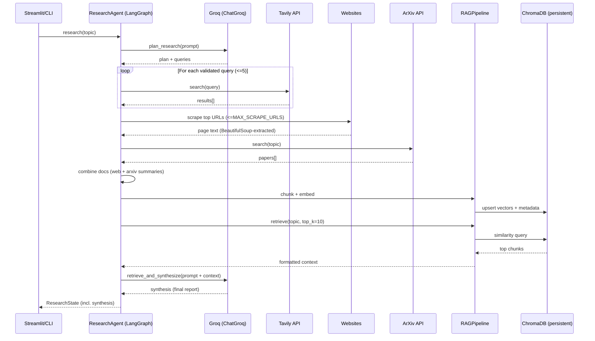

## Autonomous Research Assistant — System Flow & Technology Choices

This document consolidates:
- **Full agent orchestration** (with diagram)
- **Full end-to-end application flow** (with diagram)
- **Technologies used at each step**
- **Alternatives** to the chosen technologies
- **Why these were chosen**
- **Recommendations for improvement**

> Note: The repository also contains a more exhaustive technical document in `ARCHITECTURE.md`. This file is a focused, single-place overview.

---

## Full agent orchestration (with diagram)

### Orchestration model

The “agent” is implemented as a **deterministic LangGraph state machine** (not a free-form looping ReAct agent). The compiled graph executes a fixed pipeline of nodes, passing a shared `ResearchState` between them.

### LangGraph node orchestration (matches `agent/graph.py`)

```mermaid
graph TD
    A[Start: topic] --> B[plan_research]
    B --> C[search_web]
    C --> D[scrape_content]
    D --> E[search_arxiv]
    E --> F[process_documents]
    F --> G[embed_and_store]
    G --> H[retrieve_and_synthesize]
    H --> I[END: synthesis]

    B -.calls.-> LLM[Groq: ChatGroq / Llama 3.3]
    H -.calls.-> LLM

    C -.uses.-> T[Tavily Search API]
    D -.uses.-> S[requests + BeautifulSoup]
    E -.uses.-> X[arxiv Python client]
    F -.optionally.-> P[PDF extraction (PyPDF2)]
    G -.uses.-> R[RAG: SentenceTransformers + ChromaDB]
    H -.uses.-> R
```

### State passed between nodes (high-signal fields)

The pipeline mutates a single state object (`ResearchState`) containing:
- **Inputs & tracking**: `topic`, `request_id`, `status`, `step_count`
- **Planning**: `research_plan`, `search_queries`
- **Collection**: `search_results`, `scraped_content`, `arxiv_papers`
- **Docs for RAG**: `all_documents`
- **Storage & retrieval**: `vector_store_id`, `retrieved_chunks`
- **Output**: `synthesis`

### Agent execution lifecycle (sequence view)



---

## Full flow of the app (with diagram)

### Runtime entrypoints

- **Web UI**: Streamlit app in `app.py` (invokes `create_research_graph().research(topic)`)
- **CLI**: `main.py` (validates topic, runs agent, prints + saves markdown report)
- **Health/observability API**: FastAPI service in `health_api.py` (health/readiness + metrics endpoints)

### End-to-end application flow

```mermaid
flowchart TD
    U[User] --> UI{UI entrypoint}
    UI -->|Streamlit| ST[app.py]
    UI -->|CLI| CLI[main.py]

    ST --> V1[validate_topic + Config.validate]
    CLI --> V1

    V1 --> A[create_research_graph() / ResearchAgent]
    A --> G[LangGraph compiled pipeline]

    G --> N1[plan_research]
    N1 --> LLM1[Groq LLM]

    G --> N2[search_web]
    N2 --> W1[Tavily API]

    G --> N3[scrape_content]
    N3 --> W2[requests + BeautifulSoup]

    G --> N4[search_arxiv]
    N4 --> AX[arxiv API]

    G --> N5[process_documents]
    N5 --> DOCS[all_documents]

    G --> N6[embed_and_store]
    N6 --> EMB[SentenceTransformers]
    EMB --> VDB[ChromaDB persistent store]

    G --> N7[retrieve_and_synthesize]
    N7 --> RET[ChromaDB similarity query]
    N7 --> LLM2[Groq LLM synthesis]

    LLM2 --> OUT[synthesis markdown]
    OUT --> UIRET[UI renders / CLI prints+file]

    subgraph Obs["Observability (cross-cutting)"]
      LOG[Python logging]
      MET[In-memory metrics collector]
      PERF[performance_monitor + psutil]
      API[health_api.py (FastAPI)]
    end

    G -.records.-> LOG
    G -.records.-> MET
    G -.records.-> PERF
    API --> MET
    API --> PERF
```

---

## What technologies are used in each step of the flow?

### Per-step technology map (what runs where)

| Flow step | Where | Primary technologies | Notes |
|---|---|---|---|
| Topic input + UX | `app.py` / `main.py` | **Streamlit**, **argparse** | Streamlit provides interactive UI; CLI is minimal. |
| Input validation | `agent/validation.py` | **Python `re`**, URL parsing | Sanitization removes common injection/XSS patterns and normalizes text. |
| Config + secrets | `config.py` | **python-dotenv**, **Pydantic `SecretStr`**, env vars | Required keys: Groq + Tavily. Optional: LangSmith. |
| Orchestration | `agent/graph.py` | **LangGraph**, **LangChain messages** | Fixed pipeline edges; state passed as `ResearchState`. |
| Planning | `ResearchAgent.plan_research` | **Groq** (`langchain-groq`), **Llama 3.3** | Produces plan + queries; queries are validated/filtered. |
| Web search | `ResearchAgent.search_web` | **Tavily** (`tavily-python`) | Uses Tavily “advanced” depth and includes answers. |
| Scraping | `ResearchAgent.scrape_content` | **requests**, **BeautifulSoup4** | Strips script/style/nav/footer/header; extracts main/article/body text. |
| Academic search | `ResearchAgent.search_arxiv` | **arxiv** (Python client) | Pulls metadata + abstract/summary. |
| Document assembly | `ResearchAgent.process_documents` | Python dict/list transforms | Currently uses web docs + arXiv summaries; **PDF extraction is present but disabled** in the graph for speed. |
| Embeddings | `agent/rag.py` | **sentence-transformers** (`all-MiniLM-L6-v2`) | Local embedding model; no embedding API cost. |
| Vector DB | `agent/rag.py` | **ChromaDB PersistentClient** | Stores vectors + metadata on disk at `./chroma_db`. |
| Retrieval | `agent/rag.py` | Chroma similarity search | Retrieves top-k chunks; formats context for the LLM. |
| Synthesis | `ResearchAgent.retrieve_and_synthesize` | **Groq** + **Llama 3.3** | Generates final report markdown from retrieved context. |
| Observability | `agent/logger.py`, `agent/metrics.py`, `agent/monitoring.py`, `health_api.py` | **logging**, **psutil**, **FastAPI**, **uvicorn** | `/metrics` exposes in-memory metrics; performance monitors time + memory deltas. |

---

## What are the alternatives to the technologies that we used?

### Key alternatives (by major layer)

- **Workflow orchestration (LangGraph)**
  - Alternatives: **LlamaIndex workflows**, **Haystack pipelines**, **Prefect**, **Airflow**, custom state machine

- **LLM inference/provider (Groq)**
  - Alternatives: **OpenAI**, **Anthropic**, **Google Gemini**, **Azure OpenAI**, **local inference** (Ollama/vLLM)

- **Vector storage (ChromaDB)**
  - Alternatives: **Qdrant**, **Weaviate**, **Pinecone**, **Milvus**, **FAISS**, **pgvector**

- **Embeddings (SentenceTransformers, `all-MiniLM-L6-v2`)**
  - Alternatives: **bge-large**, **e5-large**, **OpenAI embeddings**, **Cohere embeddings**, **Voyage**

- **Web search (Tavily)**
  - Alternatives: **Bing Search API**, **Google Programmable Search**, **SerpAPI**, **Brave Search**, custom crawler

- **Scraping/extraction (requests + BeautifulSoup)**
  - Alternatives: **Playwright** (JS sites), **Selenium**, **Scrapy**, **trafilatura**, **readability-lxml**

- **PDF parsing (PyPDF2)**
  - Alternatives: **PyMuPDF (fitz)**, **pdfplumber**, **pdfminer.six**, **Grobid** (structured academic PDFs)

- **Web UI (Streamlit)**
  - Alternatives: **Gradio**, **Chainlit**, **FastAPI + React/Vue**, **Dash**

- **API service (FastAPI)**
  - Alternatives: **Flask**, **Django**, **Sanic**, **aiohttp**

---

## Why did we chose these?

### Primary rationale (as implemented in this repo)

- **LangGraph**
  - Explicit, debuggable state machine; easy to reason about the pipeline and to test node-by-node.

- **Groq + Llama 3.3**
  - Low latency is critical for interactive research; Groq provides very fast inference and a straightforward API via LangChain.

- **ChromaDB**
  - Embedded, persistent vector store with minimal operational overhead (no external service required).

- **SentenceTransformers (`all-MiniLM-L6-v2`)**
  - Local-first embeddings: low cost, no embedding API dependency, fast enough for typical document volumes.

- **Tavily**
  - Search results are returned in a structure that’s convenient for LLM pipelines (relevance scoring, summaries).

- **requests + BeautifulSoup**
  - Lightweight, reliable baseline scraping for non-JS-heavy sites; minimal complexity for an MVP.

- **Streamlit**
  - Fastest path to a usable UI entirely in Python; good fit for prototyping and internal tools.

- **FastAPI (health API)**
  - Modern typed API with easy deployment (`uvicorn`) and simple endpoints for readiness/metrics.

---

## Recommendations for improvement

### Quality & correctness

- **Add a reranker** after retrieval (cross-encoder) to improve RAG precision before synthesis.
- **Improve citations** by storing and emitting stable chunk/source references (URL + title + snippet + score).
- **Deduplicate documents** (URL canonicalization + content hashing) before chunking/embedding.

### Performance & cost

- **Parallelize scraping** (async/threads) and add **caching** for Tavily + scraping results (e.g., Redis).
- **Make PDF extraction configurable** (it exists in `ToolManager`, but is disabled in the graph by default).
- **Batch embeddings** and add a “skip embedding if already stored” strategy.

### Reliability

- **Multi-provider LLM fallback** (Groq → OpenAI/Anthropic/local) on rate limits/timeouts.
- **Stronger error surfaces** in UI (show which node failed + partial state + retry from checkpoint).

### Observability

- Export metrics in a standard format (e.g., **Prometheus**) and consider **OpenTelemetry** tracing.
- Add per-request cost and token accounting (LLM calls + search calls + embed time).

### Architecture evolution (if scaling beyond a single machine)

- Move from embedded ChromaDB to **Qdrant/Weaviate** (or `pgvector`) for multi-instance deployments.
- Add a background job queue (**RQ/Celery**) so the UI can stream progress while work runs off-thread.
